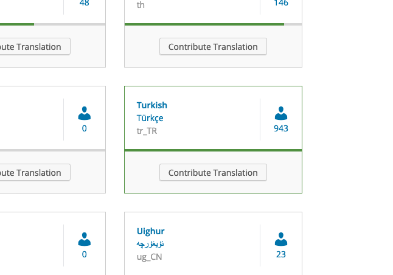

# Başlarken

### WordPress'i Türkçeye çevirmek

WordPress'i çevirmeye başlamanın en kolay yolu [translate.wordpress.org](https://translate.wordpress.org) adresine gitmektir. İsteyen herkes [WordPress.org hesabına](https://login.wordpress.org/) giriş yaparak çevirilere katkıda bulunabilir.

[translate.wordpress.org](https://translate.wordpress.org) üzerinde WordPress'in çevrilebileceği dillerin bir listesine ulaşacaksınız. [Türkçe](https://translate.wordpress.org/locale/tr/) ya da başka bir dilde çeviri yapmak için, istediğiniz dilin sayfasına ilerleyin.

WordPress çekirdeği, temalar, eklentiler, mobil uygulamalar gibi bir çok kategorideki projelere çevirileriniz ile katkıda bulunabilirsiniz. Bir proje seçmekte zorlanıyorsanız [eklentiler](https://translate.wordpress.org/locale/tr/default/stats/plugins/) ve [temalar](https://translate.wordpress.org/locale/tr/default/stats/themes/) için istatistikler sayfalarını inceleyebilirsiniz. Bu sayfalarda projelerin durumları ve çeviri ihtiyaçları daha kolay bir şekilde görüntülenebilir.

Çevirilerinizin WordPress'in bir parçası haline gelebilmesi için öncelikle bir&#x20;
