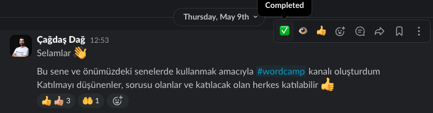

# Slack'i Nasıl Kullanıyoruz?

Bu belgede Slack kullanımına dair bir takım yöntem ve kuralları sizlerle paylaşmayı hedefliyoruz.

### Profiliniz

* Görünen adınızı (Display name) size hitap edilmesini istediğiniz adınız olarak belirleyin
* Kim olduğunuzu bir bakışta anlatacak bir profil fotoğrafı kullanın
* Eğer Slack dışında size ulaşılmasında bir sıkıntı yoksa;
  * Profilinizdeki e-posta alanına etkin olarak kullandığınız e-posta adresinizi girin
  * Profilinizdeki telefon alanına etkin olarak kullandığınız telefonunuzu girin (Acil durumlar için)

### Adab-ı Muaşeret

* **Thread kullanımı:** İster kanal, ister özel yazışmalarda, konunun özetini içeren bir mesaj gönderip, **ayrıntılarını thread açarak iletin**. Bu sayede kanala ya da yazışmaya göz atmak istendiğinde daha hızlı görsel tarama yapılabiliyor.
* **Etiketleme:** Mesajınız ile ilgili olduğunu düşündüğünüz kişileri @ ile etiketlemekten çekinmeyin. Hatta bilgi vermek istedikleriniz olursa, mesajınızdan sonra yeni bir satırda **“bilgi: @isim”** ya da **“CC: @isim”** şeklinde etiketleyebilirsiniz. Etiketlediğiniz kişilerden beklentilerinizi açık bir şekilde ifade ettiğinizden emin olun.
* **Bildirimler:** Varsayılan olarak Slack bildirimleri açık durumda. Yoğun çalışma yapacaksanız bildirimleri bir süreliğine durdurabilirsiniz.
* **Mesajları birleştirme:** Eğer bir konuda söyleyecek çok şeyiniz varsa, mümkünse ayrı ayrı mesajlar göndermek yerine, aynı mesajın içinde yeni satır yaparak ilerleyin. Eğer henüz mesajınıza yanıt almadıysanız ve eklemek/düzeltmek istedikleriniz varsa, mesajınızı düzenleyerek değişiklikleri gerçekleştirin. Mesajınızı düzenlemek için 5 dakikalık süre kısıtı olduğunu unutmayın.
* **Slack’in metin biçimlendirme özelliklerini kullanın:** Madde imleri, numaralandırma, yeni satır, kod görünümü, bağlantılar vb. Slack’in size sunduğu biçimlendirme özelliklerini sonuna kadar kullanın. Mesajınızı okuyan kişilere aktarmak istediklerinizi en iyi aktarabileceğiniz şekilde biçimlendirin.
* **Snippet kullanımı:** 10 satırdan daha fazla kod ekleyecekseniz **/snippet** özelliği ile kodunuzu snippet haline getirin. Bu sayede dile göre kod renklendirme, isimlendirme gibi birçok faydalı özellikten faydalanabilirsiniz.
* **Özel mesajlar:** Açık iletişimi hedeflediğimiz için özel mesajlardan ziyade herkese açık kanallardan yazışmayı tercih ediyoruz. Konu başkalarını ilgilendirmese bile yazışmayı kanalda yapmanız pasif bilgi transferi sağlayacağı için uzun vadede faydalı olacaktır.\
  Elbette özel mesaj kullanabileceğiniz durumları engellemiyoruz;
  * Dostane sohbetler
  * Kişiler arasında gizlilik önemine sahip yazışmalar
  * Bireysel geri bildirimler vb.

Uzaktan çalışan ekiplerde iletişim ve çalışma kültürü kurmak zorlayıcı olabiliyor. Umuyoruz ki bu maddeler ile bir nebze olsun hepimizin hayatını kolaylaştırabiliriz.

### Hızlı Eylemler

Yazışmalarda karşı tarafı hızlıca bilgilendirmek için hızlı eylemleri sıkça kullanmanızı rica ediyoruz;

✅ - İş/görev tamamlandı

👁️ - Görüldü / bilgi sahibi olundu

👍 - Onaylama / aynı görüşe sahip olma

Bu emojiler bir mesajın üzerine fare imlecini getirdiğinizde kolay erişim için emoji simgesinin soluna konumlandırılmışlardır ve tek tıklamayla mesaja eklenebilir.\

<figure><figcaption></figcaption></figure>

### Sürüm Geçmişi

| Sürüm | Hazırlayan | Tarih          |
| ----- | ---------- | -------------- |
| 0.9   | Emre Erkan | 7 Haziran 2024 |
